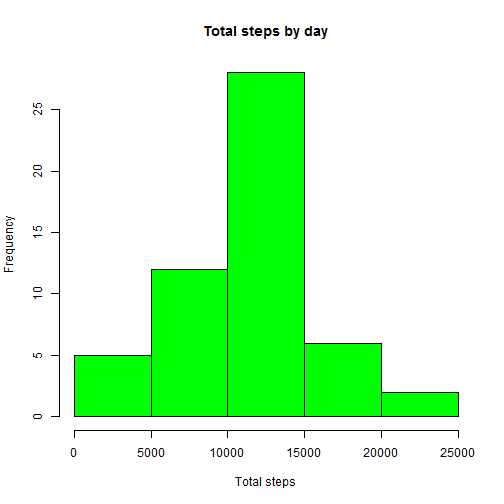
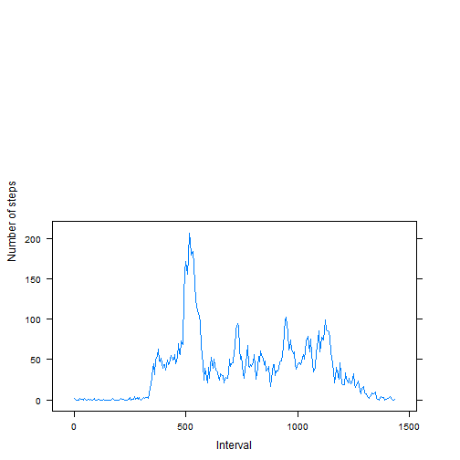
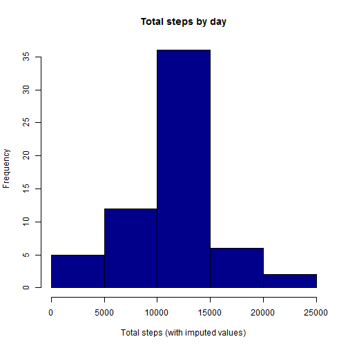
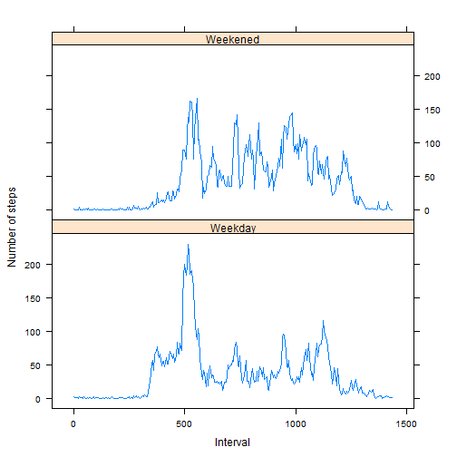

##Loading and preprocessing the data

####1. Load the data
First we'll load the activity data (assuming the activity.csv file is present in the working directory). Then, let's also take a look at the first 20 records of the dataset.


```r
# Read the data, review first 20 records
activity <- read.csv("activity.csv", header=TRUE, sep=",",
                     colClasses=c("numeric", "character", "numeric"))
head( activity, 20)
```

```
##    steps       date interval
## 1     NA 2012-10-01        0
## 2     NA 2012-10-01        5
## 3     NA 2012-10-01       10
## 4     NA 2012-10-01       15
## 5     NA 2012-10-01       20
## 6     NA 2012-10-01       25
## 7     NA 2012-10-01       30
## 8     NA 2012-10-01       35
## 9     NA 2012-10-01       40
## 10    NA 2012-10-01       45
## 11    NA 2012-10-01       50
## 12    NA 2012-10-01       55
## 13    NA 2012-10-01      100
## 14    NA 2012-10-01      105
## 15    NA 2012-10-01      110
## 16    NA 2012-10-01      115
## 17    NA 2012-10-01      120
## 18    NA 2012-10-01      125
## 19    NA 2012-10-01      130
## 20    NA 2012-10-01      135
```

####2. Process/transform the data (if necessary) into a format suitable for your analysis

Initial observations

- The **steps** column has NA values.

- It appears the interval field is time at 5 minute intervals stored as a number (jumps from 55 to 100 instead of 60). Let's create a new column called interval60 that represents the elapsed minutes correctly i.e. ...55, 60, 65.... We'll use this **interval60** column for our computations.


```r
# Create a new column interval60 that is elapsed minutes/time interval
hourpart <- trunc(activity$interval / 100)
minpart <- 100 * (activity$interval/100 - hourpart)
activity$interval60 <- hourpart*60 + minpart
```

- Also, let's create a new column called **datetime** and populate it using the date and intervals.


```r
# Use date and interval (time) fields to create a date-time column
activity$astime <- sprintf("%04d", as.numeric(activity$interval))
activity$astime <-paste(substr(activity$astime, 1, 2), ":", substr(activity$astime, 3,4), sep="")
activity$datetime <- strptime( paste(activity$date, activity$astime),
                               format="%Y-%m-%d %H:%M")
activity$astime <- NULL  

# Review first 20 records
head( activity, 20)
```

```
##    steps       date interval interval60            datetime
## 1     NA 2012-10-01        0          0 2012-10-01 00:00:00
## 2     NA 2012-10-01        5          5 2012-10-01 00:05:00
## 3     NA 2012-10-01       10         10 2012-10-01 00:10:00
## 4     NA 2012-10-01       15         15 2012-10-01 00:15:00
## 5     NA 2012-10-01       20         20 2012-10-01 00:20:00
## 6     NA 2012-10-01       25         25 2012-10-01 00:25:00
## 7     NA 2012-10-01       30         30 2012-10-01 00:30:00
## 8     NA 2012-10-01       35         35 2012-10-01 00:35:00
## 9     NA 2012-10-01       40         40 2012-10-01 00:40:00
## 10    NA 2012-10-01       45         45 2012-10-01 00:45:00
## 11    NA 2012-10-01       50         50 2012-10-01 00:50:00
## 12    NA 2012-10-01       55         55 2012-10-01 00:55:00
## 13    NA 2012-10-01      100         60 2012-10-01 01:00:00
## 14    NA 2012-10-01      105         65 2012-10-01 01:05:00
## 15    NA 2012-10-01      110         70 2012-10-01 01:10:00
## 16    NA 2012-10-01      115         75 2012-10-01 01:15:00
## 17    NA 2012-10-01      120         80 2012-10-01 01:20:00
## 18    NA 2012-10-01      125         85 2012-10-01 01:25:00
## 19    NA 2012-10-01      130         90 2012-10-01 01:30:00
## 20    NA 2012-10-01      135         95 2012-10-01 01:35:00
```

Now reviewing the first 20 records, we see the original dataset and the new **interval60** and **datetime** columns. The interval60 is an elapsed/time interval and the datetime column. has a full date-time (in case we need it for processing).

##What is mean total number of steps taken per day?

####1. Make a histogram of the total number of steps taken each day

For this part of the assignment, we'll first exclude the records with 'NA' steps. Then we'll compute the total number of steps per day, and plot a historgram of **Total steps by day**.


```r
# Compute total steps by date, remove NAs
nona.activity <- activity[!is.na(activity$steps),]
totalsteps <- aggregate( nona.activity$steps, 
                         by=list(nona.activity$date), 
                         FUN=sum, na.rm=TRUE)
suppressWarnings(library(plyr))
totalsteps <- rename( totalsteps, c("Group.1"="date","x"="steps"))

# Plot histogram by date
hist( totalsteps$steps, main="Total steps by day",
      xlab="Total steps", col="green")
```

 

####2. Calculate and report the mean and median total number of steps taken per day

Let's compute the mean and the median for total number of steps taken per day.


```r
# Compute median and mean values, ignore NAs
orig.mean <- mean(totalsteps$steps, na.rm=TRUE)
print(orig.mean)
```

```
## [1] 10766.19
```

```r
orig.median <- median(totalsteps$steps, na.rm=TRUE)
print(orig.median)
```

```
## [1] 10765
```

The **mean** value is **10766.19** and **median** value is **10765.00**

##What is the average daily activity pattern?
####1. Make a time series plot (i.e. type = "l") of the 5-minute interval (x-axis) and the average number of steps taken, averaged across all days (y-axis)

Let's compute the average number of steps across all days. For this, we'll create a new **daily** data frame.


```r
# Average daily time series
daily <- aggregate( nona.activity$steps, by=list(nona.activity$interval60), FUN=mean, na.rm=TRUE)
daily <- rename( daily, c("Group.1"="interval60","x"="steps"))
```

We'll use an xy-plot to display the average daily activity as a time series. 


```r
suppressWarnings(library(lattice))
xyplot(steps ~ interval60, daily, type = "l", 
       layout = c(1, 2), xlab = "Interval", ylab = "Number of steps")
```

 

####2. Which 5-minute interval, on average across all the days in the dataset, contains the maximum number of steps?


```r
# Identify the interval at max average steps
maxinterval60 <- daily[daily$steps==max(daily$steps),1]

# Select the original interval value for maxinterval
maxinterval <- unique(activity[activity$interval60==maxinterval60, 3])
print(maxinterval)
```

```
## [1] 835
```

We can see the 5-minute interval (original) for the maximum number of steps on average is **835** (or 515 in elapsed/minutes time).

##Imputing missing values
####1. Calculate and report the total number of missing values in the dataset (i.e. the total number of rows with NAs)

Before we handle the missing (NA) values, let's first check the total number of NAs in the original data set.

```r
# handle na values
missingvals <- sum(is.na(activity$steps))
print(missingvals)
```

```
## [1] 2304
```

####2. Devise a strategy for filling in all of the missing values in the dataset. The strategy does not need to be sophisticated. For example, you could use the mean/median for that day, or the mean for that 5-minute interval, etc.
####3. Create a new dataset that is equal to the original dataset but with the missing data filled in.

So, there are **2304 NAs** in the original data set. Let's create a new data set and impute the missing (NA) values by using the mean values corresponding to that 5-minute interval. 


```r
imputed.activity <- activity
for( i in 1:nrow(daily)){
  currint <- daily[i,1]
  imputed.activity[is.na(imputed.activity$steps) & 
                     imputed.activity$interval60 == currint,]$steps <- daily[daily$interval60==currint, 2]
}

imputed.missingvals <- sum(is.na(imputed.activity$steps))
print(imputed.missingvals)
```

```
## [1] 0
```

After the imputation, as expected, the number of NAs in the data set is 0. 

####4. Make a histogram of the total number of steps taken each day and Calculate and report the mean and median total number of steps taken per day. Do these values differ from the estimates from the first part of the assignment? What is the impact of imputing missing data on the estimates of the total daily number of steps?

Now we'll compute the total number of steps per day with the imputed data set.

```r
# Compute total steps by date, ignore NAs
imputed.totalsteps <- aggregate( imputed.activity$steps, 
                                 by=list(imputed.activity$date), 
                                 FUN=sum, na.rm=TRUE)
suppressWarnings(library(plyr))
imputed.totalsteps <- rename( imputed.totalsteps, c("Group.1"="date","x"="steps"))
```

We'll plot a histogram for Total steps by day (imputed) and calculate the mean and median for this data set.

```r
# Plot histogram by date
hist( imputed.totalsteps$steps, main="Total steps by day",
      xlab="Total steps (with imputed values)", col="darkblue")
```

 

```r
imputed.mean <- mean(imputed.totalsteps$steps, na.rm=TRUE)
print(imputed.mean)
```

```
## [1] 10766.19
```

```r
imputed.median <- median(imputed.totalsteps$steps, na.rm=TRUE)
print(imputed.median)
```

```
## [1] 10766.19
```

The new **mean** value is **10766.19** and new **median** value is **10766.19**. (note: the original values were mean=10766.19 and median=10765.00). The impact of the imputation appears to be really small, the mean stayed at the same value, and median moved by 1.19 over the original.

##Are there differences in activity patterns between weekdays and weekends?

Using the datetime column we created earlier, let's identify the type of day- weekday or weekend. We'll create a new factor variable and assign it a value of "Weekend" or "Weekday".

```r
# Create a new column to identify weekend/weekday type
imputed.activity$type <- ifelse(weekdays(imputed.activity$datetime) == "Saturday" | 
                                weekdays(imputed.activity$datetime) == "Sunday", 
                                "Weekened",  "Weekday")
imputed.activity$type <- factor(imputed.activity$type)
```

Let's create a panel plot of the average total steps for a 5-minute interval by the type- weekday and weekend.

```r
# Average daily time series
daytype <- aggregate( steps ~ interval60 + type, data=imputed.activity, mean, na.rm=TRUE)

suppressWarnings(library(lattice))
xyplot(steps ~ interval60 | type, daytype, type = "l", 
       layout = c(1, 2), xlab = "Interval", ylab = "Number of steps")
```

 

####This concludes the submission for **Reproducible Research- Peer Assessment 1**.
